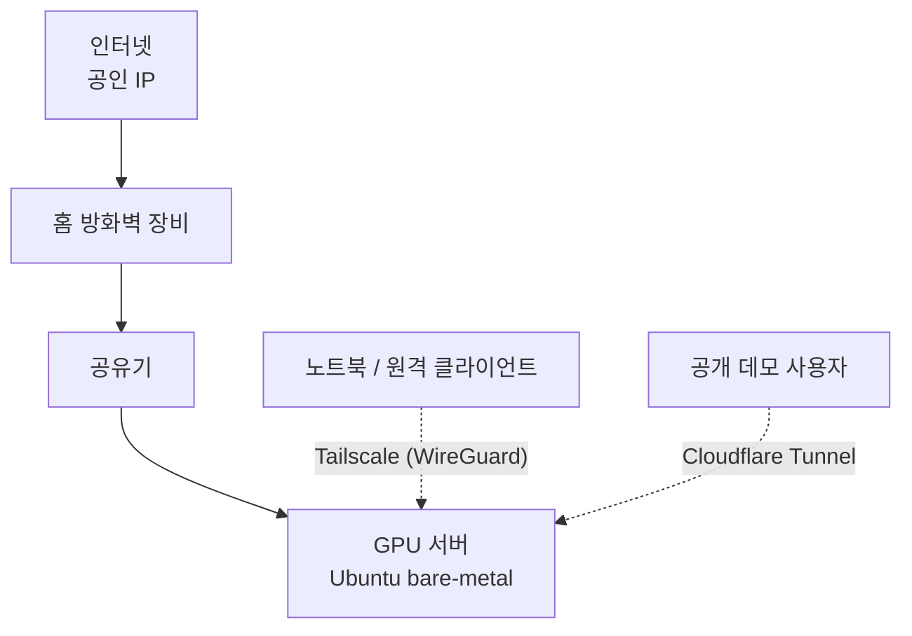
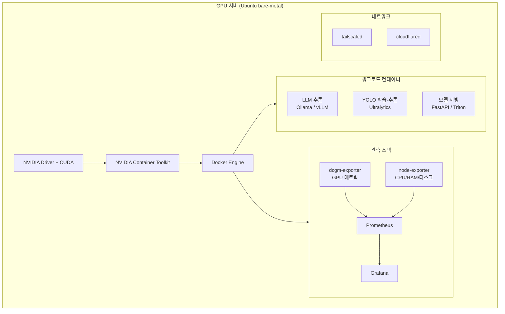

# home-gpu-server

개인 데스크탑을 GPU 서버로 전환해, 로컬 LLM 추론과 YOLO 학습을 함께 돌릴 수 있는 홈랩을 만드는 기록입니다.

노트북에서 접속해 작업하고, 서버는 항상 켜둔 채 학습·추론·모니터링을 담당합니다.

---

## 하드웨어

| 구성 | 사양 |
|---|---|
| GPU | RTX 5070 Ti (16GB VRAM, Blackwell / sm_120) |
| CPU | Ryzen 5 9600X (6C/12T) |
| RAM | 32GB |
| OS | Ubuntu LTS (bare-metal) |

> **설계 메모** — YOLO 워크로드는 VRAM보다 CPU 코어 수(데이터 로딩), RAM(worker 프로세스), NVMe 처리량(데이터셋 I/O)이 먼저 병목이 됩니다. LLM 서빙과는 최적화 지점이 다르므로, 이후 업그레이드 판단도 이 기준으로 합니다.

---

## 1. 목표 인프라

### 1.1 네트워크 경로



### 1.2 핵심 설계 원칙: 인바운드 포트를 열지 않는다

방화벽 장비와 공유기가 직렬로 있는 구성은 NAT가 두 번 걸리기 쉽고, 포트 포워딩을 하려면 두 장비를 모두 손봐야 합니다. 이 프로젝트는 **포워딩을 아예 쓰지 않는 방향**으로 갑니다.

| 용도 | 수단 | 방식 |
|---|---|---|
| 개인 관리 트래픽 (SSH, Grafana, MLflow, K3s) | Tailscale | 서버가 밖으로 나가는 연결만 사용 |
| 공개 데모 엔드포인트 | Cloudflare Tunnel | `cloudflared`가 밖으로 나가는 연결만 사용 |

두 방식 모두 **아웃바운드 연결**만 쓰므로 이중 NAT와 무관하게 동작하고, 공인 IP가 유동이어도 상관없습니다. 방화벽 장비에서는 인바운드를 전부 막아둔 상태를 유지합니다.

**알려진 제약** — Cloudflare 프록시는 응답 타임아웃이 100초대(약 120초)입니다. 긴 추론이나 학습 트리거를 여기에 태우면 끊깁니다. 공개 경로는 짧은 데모 요청만, 오래 걸리는 작업은 Tailscale 경유 또는 비동기 작업 큐로 처리합니다.

### 1.3 GPU 서버 내부 논리 구성



컨테이너 개수가 늘어나면 K3s로 옮기되, 초기에는 Docker Compose로 시작합니다. 오케스트레이션은 필요해진 다음에 도입합니다.

### 1.4 로드맵

- [x] 리포지토리 생성
- [ ] **Step 1 — gpt-oss-20b 로컬 추론** (아래)
- [ ] Step 2 — Grafana + Prometheus + dcgm-exporter 관측 스택
- [ ] Step 3 — Tailscale 구성, 노트북에서 원격 작업
- [ ] Step 4 — YOLO26 학습 파이프라인 (Ultralytics + MLflow + DVC)
- [ ] Step 5 — 어노테이션·데이터셋 관리 (CVAT/Label Studio, FiftyOne)
- [ ] Step 6 — 모델 서빙 + Cloudflare Tunnel 데모 공개
- [ ] Step 7 — K3s 전환 검토

---

## 2. 첫 발걸음: gpt-oss-20b

### 2.1 왜 이 모델부터인가

YOLO 파이프라인은 데이터셋·어노테이션·학습 루프까지 준비할 게 많습니다. 반면 LLM 추론은 **모델 하나 띄우고 응답이 오면 끝**이라, 드라이버 → CUDA → 컨테이너 → GPU 접근까지의 경로가 제대로 뚫렸는지 가장 빠르게 검증할 수 있습니다. 즉 이 단계의 목적은 "좋은 LLM 쓰기"가 아니라 **GPU 스택 헬스체크**입니다.

gpt-oss-20b를 고른 이유:

- 21B 파라미터 MoE 구조지만 토큰당 3.6B만 활성화되어, 21B급 치고 생성 속도가 빠릅니다
- MXFP4로 네이티브 양자화되어 출시돼 16GB 메모리 안에 들어갑니다 — 5070 Ti에 딱 맞는 크기
- Apache 2.0 라이선스라 나중에 공개 서비스에 붙여도 걸림돌이 없습니다

### 2.2 VRAM 예산

16GB는 "들어가긴 하는" 크기이므로 컨텍스트 길이를 함부로 늘리면 안 됩니다.

| 항목 | 크기 |
|---|---|
| 가중치 (MXFP4) | 약 12GB |
| KV 캐시 @ 8K | 약 0.4GB |
| KV 캐시 @ 32K | 약 1.5GB |
| KV 캐시 @ 128K | 약 6GB |
| 런타임 오버헤드 | 1~2GB |

→ **8K~32K 컨텍스트가 현실적인 운용 범위.** 128K를 켜면 OOM이 납니다. 데스크탑 겸용이라 디스플레이가 VRAM을 쓰고 있다면 그만큼 더 빠듯해집니다.

### 2.3 실행

가장 마찰이 적은 경로부터 시작합니다.

```bash
# 사전 확인
nvidia-smi

# Ollama 설치 및 실행
curl -fsSL https://ollama.com/install.sh | sh
ollama run gpt-oss:20b
```

컨테이너 경로로 GPU 접근까지 함께 검증하려면:

```bash
docker run -d --gpus all \
  -v ollama:/root/.ollama \
  -p 11434:11434 \
  --name ollama ollama/ollama

docker exec -it ollama ollama run gpt-oss:20b
```

### 2.4 확인 항목

이 단계에서 반드시 눈으로 확인할 것들입니다.

- [ ] `nvidia-smi`에서 드라이버와 GPU가 정상 인식되는가
- [ ] 추론 중 `nvidia-smi`의 VRAM 사용량 — 12~14GB 선인지, CPU로 오프로드되고 있지는 않은지
- [ ] 초당 토큰 수 (tok/s) 기록 — 이후 설정 변경의 기준선
- [ ] 컨텍스트를 8K → 32K로 늘렸을 때의 VRAM 증가폭
- [ ] Docker 컨테이너에서 `--gpus all`로 GPU가 보이는가 → NVIDIA Container Toolkit 설치 검증
- [ ] Blackwell(sm_120) 커널 호환성 — Ollama는 대부분 자동 처리하지만, vLLM/Transformers 경로로 갈 경우 PyTorch·Triton 버전이 sm_120을 지원하는지 확인 필요

### 2.5 다음으로

여기서 얻은 tok/s와 VRAM 수치를 Grafana 대시보드의 첫 지표로 씁니다. `dcgm-exporter`를 붙이면 같은 수치를 시계열로 보게 되므로, Step 2로 자연스럽게 이어집니다.

---

## 라이선스 메모

- 이 리포지토리의 코드/문서: (미정 — 공개 전환 시점에 결정)
- **Ultralytics YOLO는 AGPL-3.0** 입니다. YOLO 기반 서비스를 공개 엔드포인트로 노출하면 소스 공개 의무가 발생할 수 있습니다. Step 6 이전에 반드시 재검토할 것.
- gpt-oss-20b: Apache 2.0
